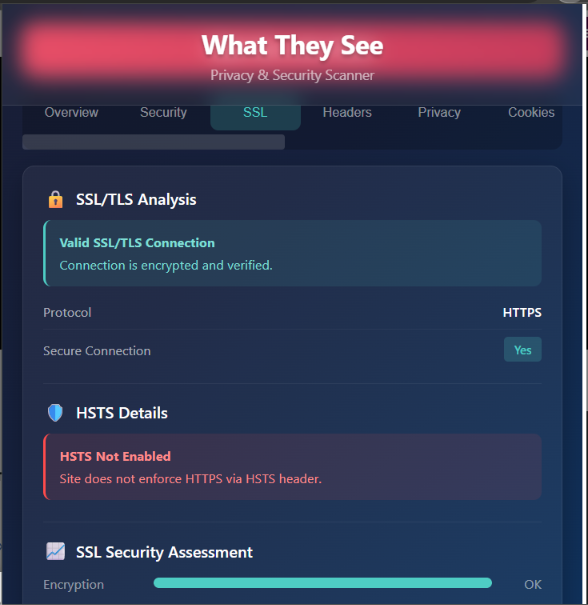
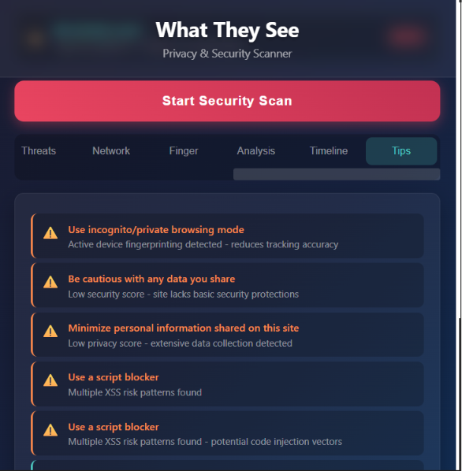
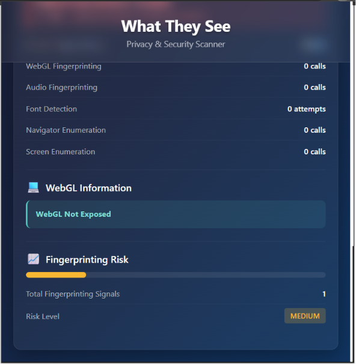

  

# What They See - Privacy & Security Scanner

> A powerful Chrome extension that analyzes what websites track, collect, and detect about you — then gives you actionable recommendations to stay safe online.

   

---

## Features

### Core Scanning
- **Real-time Privacy Analysis** — Scans any website for tracking elements, third-party scripts, and data collection methods
- **Security Score** — Get an instant A+ to F grade based on 50+ security and privacy factors
- **Deep Scan Engine** — Performs 70+ individual security checks on every page load, chunked with `requestIdleCallback` to avoid freezing the page

### Side Panel View
- **Chrome Side Panel** — Docked side-by-side with the page for a true split-view experience. Opens automatically when you click the extension icon.
- **Auto-scan on tab switch** — Results update as you navigate between tabs
- **Persistent view** — Stays open until you close it, unlike the popup

### Personalized Threat Model
- **First-scan dialog** — Choose what concerns you most: Advertising, Surveillance, or Financial Security
- **Custom scoring weights** — Your threat model adjusts scoring penalties so the results reflect your actual risk priorities
- **Persistent preference** — Saved to `chrome.storage.local`, changeable on each scan

### Privacy Diff
- **Scan comparison** — Every scan is saved. When you re-scan the same domain, see exactly what changed: new trackers added, headers modified, score changes
- **Time-tracked history** — Up to 10 historical scans per domain stored locally

### Network Story
- **Narrative timeline** — Instead of raw tables, get a human-readable story: "When the page opened, Facebook Pixel knew within 200ms that you were viewing this page. 800ms later, Hotjar started recording your mouse movement."
- **Non-technical friendly** — Makes network analysis understandable for anyone

### Evidence Pack (GDPR-Ready Export)
- **Signed JSON report** — Export a structured evidence pack with timestamp, SHA-256 hash, session ID, all scan results, threat model, and recommendations
- **Summarized data** — Network entries are condensed (domain + truncated URL per entry, top 30 unique domains, 30-entry timeline cap) instead of dumping raw arrays
- **Unique per scan** — Each export gets a unique `sessionId` in the filename (e.g. `evidence-pack-google.com-m1a2b3c4.json`), so no files are overwritten
- **Actionable for advocacy** — Designed for GDPR complaints or journalist submissions
- **One-click download** — Click "Export Evidence Pack" in the Overview tab

### Threat Detection
- **Tracking Pixel Detection** — Identifies hidden 1x1 pixels, invisible iframes, and beacon scripts
- **Fingerprinting Detection** — Catches canvas, WebGL, audio, font, screen, and navigator fingerprinting attempts
- **Cryptomining Detection** — Detects unauthorized cryptocurrency mining scripts (CoinHive, CryptoLoot, etc.)
- **Keylogging Detection** — Identifies suspicious keystroke monitoring patterns using regex-based analysis
- **Formjacking & Magecart** — Detects payment form tampering and credit card skimming
- **Data Exfiltration** — Spots patterns of unauthorized data being sent to external servers
- **XSS Risk Patterns** — Identifies cross-site scripting vulnerabilities using regex pattern matching
- **SQL Injection Patterns** — Detects suspicious URL parameters that may indicate injection attempts
- **Open Redirect Detection** — Flags potentially malicious redirect chains

### Privacy Analysis
- **Cookie Audit** — Lists all cookies, flags tracking cookies, and checks security attributes (Secure, SameSite, HttpOnly)
- **Evercookie Detection** — Identifies super-persistent tracking cookies that survive browser resets
- **Browser Storage Analysis** — Inspects localStorage, sessionStorage, and IndexedDB for tracking data
- **Clipboard Monitoring** — Detects websites that listen to copy/paste events
- **Geolocation Tracking** — Flags use of location APIs
- **Camera/Microphone Access** — Detects media device API usage
- **WebRTC Leak Detection** — Checks for potential IP leaks through WebRTC

### Network Monitoring
- **Request Categorization** — Automatically classifies network requests as tracking, advertising, social, analytics, CDN, or essential
- **Third-party Domain Tracking** — Lists all external domains contacted by the page
- **Network Timeline** — Visualizes when each request fires during page load with real duration tracking
- **Sensitive Data in URLs** — Flags requests that may leak sensitive information in URL parameters

### Security Headers
- **Content Security Policy (CSP)** — Analyzes CSP policy strength and flags unsafe directives
- **HSTS Check** — Verifies HTTP Strict Transport Security configuration
- **X-Frame-Options** — Checks clickjacking protection
- **X-Content-Type-Options** — Verifies MIME type sniffing protection
- **Permissions Policy** — Reviews feature access restrictions

### Advanced Checks
- **Mixed Content Detection** — Finds HTTP resources loaded on HTTPS pages
- **Subresource Integrity (SRI)** — Checks if external scripts have integrity hashes
- **DOM Vulnerabilities** — Identifies dangerous DOM manipulation patterns using regex analysis
- **Shadow DOM Analysis** — Detects hidden elements that may contain tracking code
- **Web Worker Monitoring** — Flags excessive background workers
- **WebAssembly Detection** — Identifies WASM usage that could be used for mining
- **Service Worker Detection** — Checks for active service workers
- **Autofill Abuse Detection** — Spots potential autofill data harvesting

### Centralized Scoring Configuration
- **scoring-weights.js** — All scoring weights and threat model multipliers in a single configuration file
- **Easy tuning** — Change weights without touching logic code
- **Threat model multipliers** — Separate weight sets for Advertising, Surveillance, and Financial threat models

---

## Installation

### Option 1: Download from GitHub
1. Download or clone this repository
2. Open `install.html` in your browser for a visual step-by-step guide
3. Or follow the manual steps below

### Option 2: Manual Installation
1. Download or clone this repository
2. Open Chrome and navigate to `chrome://extensions/`
3. Enable **Developer mode** (toggle in top-right corner)
4. Click **Load unpacked**
5. Select the extension folder
6. The extension icon will appear in your toolbar

### Option 3: Install Guide Page
Open the `install.html` file included in this repository for an interactive, visual installation walkthrough.

---

## Usage

1. **Click the extension icon** in your Chrome toolbar — the Side Panel opens docked to the side of the page
2. **Choose your threat model** on first scan (Advertising / Surveillance / Financial) or skip
3. **Browse through tabs** to explore different aspects of the analysis:
   - **Overview** — Quick summary with security score, threat chart, and Privacy Diff
   - **Security** — Connection security, headers, form safety, XSS/DOM risks
   - **SSL** — Certificate and encryption details
   - **Headers** — Security header analysis
   - **Privacy** — Cookies, fingerprinting, storage, analytics tools
   - **Cookies** — Detailed cookie breakdown with tracking flags
   - **Threats** — All detected threats sorted by severity
   - **Network** — Domain connections, request categories, and Network Story narrative
   - **Fingerprint** — Device fingerprinting attempts and vectors
   - **Analysis** — Deep scan results with 50+ security checks
   - **Timeline** — Network request waterfall visualization
   - **Tips** — Personalized recommendations based on scan results
4. **Export Evidence Pack** — Click the export button in Overview to download a signed JSON report for GDPR complaints

---

## Screenshots

  

The extension features a dark, modern UI with color-coded severity badges, interactive charts, and a tabbed results layout.

| SSL/TLS Analysis | Security Tips | Fingerprinting Detection |
|:---:|:---:|:---:|
|  |  |  |

---

## Permissions

| Permission | Purpose |
|------------|---------|
| `scripting` | Inject scan scripts into web pages |
| `activeTab` | Access the current tab for analysis |
| `storage` | Cache scan results, threat model, and scan history locally |
| `webRequest` | Monitor network traffic for trackers |
| `sidePanel` | Open the Side Panel for split-view scanning |

---

## Technical Details

- **Manifest Version:** 5
- **Browser:** Google Chrome 114+ (and Chromium-based browsers)
- **Architecture:** Service worker background + content script injection + Side Panel
- **Scan Engine:** Rule-based analysis with 70+ regex-based detection patterns
- **Chunked Execution:** Deep scans use `requestIdleCallback` to avoid freezing heavy pages
- **Real Duration Tracking:** Network timeline tracks actual request durations via `onBeforeSendHeaders` → `onCompleted`
- **Centralized Scoring:** All weights in `scoring-weights.js` for easy tuning
- **Privacy:** All analysis runs locally — no data is sent to external servers

---

## Contributing

Contributions are welcome! Feel free to open issues or submit pull requests.

1. Fork the repository
2. Create your feature branch (`git checkout -b feature/amazing-feature`)
3. Commit your changes (`git commit -m 'Add amazing feature'`)
4. Push to the branch (`git push origin feature/amazing-feature`)
5. Open a Pull Request

---

## License

This project is licensed under the GNU Affero General Public License v3.0 — see the [LICENSE](LICENSE) file for details.

---

## Commercial Licensing

This project is available under the GNU AGPL v3 license. If you need a commercial license, proprietary integration, or custom development, please contact the author.

---

## Disclaimer

This extension is a security analysis tool designed for educational and defensive purposes. It helps users understand what data websites collect about them. Always practice responsible browsing and keep your browser updated.
